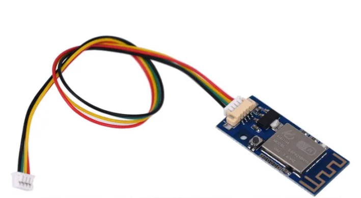

# ESPhome-Sinilink-WFPOW
# ESP Modbus Uart Controller
* https://templates.blakadder.com/sinilink_XY-WFPOW.html

* GPIO 1 = TX  (UART, Sensor, Output)
* GPIO 3 = RX  (UART, Sensor, Output)
* GPIO 2 = inverted LED
* GPIO 4 = mechanical Button

| Pin   | Name      | Function
| ----- | --------- | ----------------------------- 
| GPIO1     | TX        | UART TX                 
| GPIO2     | LED       | inverted LED                  
| GPIO3     | RX        | UART RX                          
| GPIO4     | Button    | meachnical Button                      
| 5V        | VDD       | 5V Power Input regulator to 3.3V                          
| GND       | GND       | Board Ground
| 3.3V      | VDDA      | 3.3V alternative                      
| IO0       | flash     | to GND to flash
| RST       | Reset     | Restart esp

