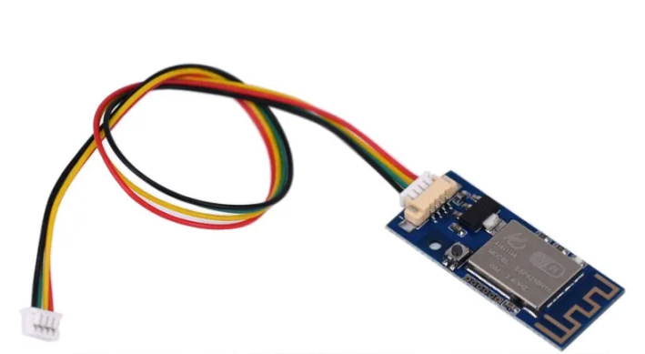

# Sinilink-WFPOW
#  Modbus Uart Controller

---
title: Sonoff S20
date-published: 2019-10-11
type: plug
standard: uk, us
---

```yaml
esp8266:
  board: esp8285

# if use GPIO1 and GPIO3 ( TX and RX ) logger off (baudrate: 0)
logger:
  baud_rate: 0
```


| Pin   | Name      | Function
| ----- | --------- | ----------------------------- 
| GPIO1     | TXD       | UART TX                 
| GPIO2     | LED       | inverted LED                  
| GPIO3     | RXD       | UART RX                          
| GPIO4     | Button    | meachnical Button                      
| 5V        | VDD       | 5V Power Input regulator to 3.3V                          
| GND       | GND       | Board Ground
| 3.3V      | VDDA      | 3.3V alternative                      
| IO0       | flash     | to GND to flash
| RST       | Reset     | Restart esp




#Example for UART on GPIO1 GPIO3
```yaml
#Example for UART on GPIO1 GPIO3
esp8266:
  board: esp8285

# if use GPIO1 and GPIO3 ( TX and RX ) logger off (baudrate: 0)
logger:
  baud_rate: 0

uart:
  - id: uart_bus
    tx_pin: GPIO1
    rx_pin: GPIO3
    baud_rate: BAUDRATE
    debug:
      direction: BOTH
      dummy_receiver: true

binary_sensor:
  - platform: gpio
    name: "GPIO4 Taste"
    pin:
      number: GPIO4
      mode: INPUT_PULLUP
      inverted: True
      
switch:
  - platform: gpio
    pin: GPIO2
    inverted: true
    name: "GPIO2 LED inverted"
```
```yaml
# LED GPIO2 can use by switch: or light:
light:
  - platform: status_led
    name: "LED state"
    pin:
      number: GPIO2
      inverted: true
```

# Useful links
*  [Tasmota Sinilink XY-WFPOW](https://templates.blakadder.com/sinilink_XY-WFPOW.html)
  
