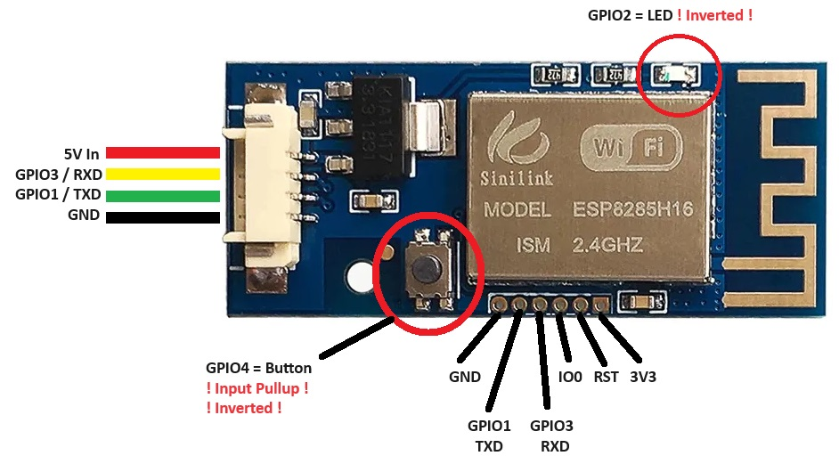

# ESPhome-Sinilink-WF-POW
# ESP Modbus Uart Controller
* https://templates.blakadder.com/sinilink_XY-WFPOW.html

* GPIO 1 = TX  (UART, Sensor, Output)
* GPIO 3 = RX  (UART, Sensor, Output)
* GPIO 2 = inverted LED
* GPIO 4 = mechanical Button

